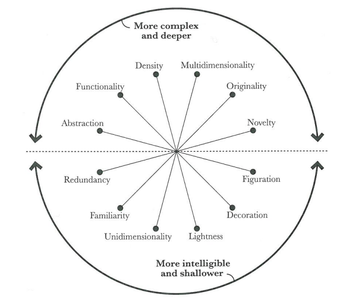
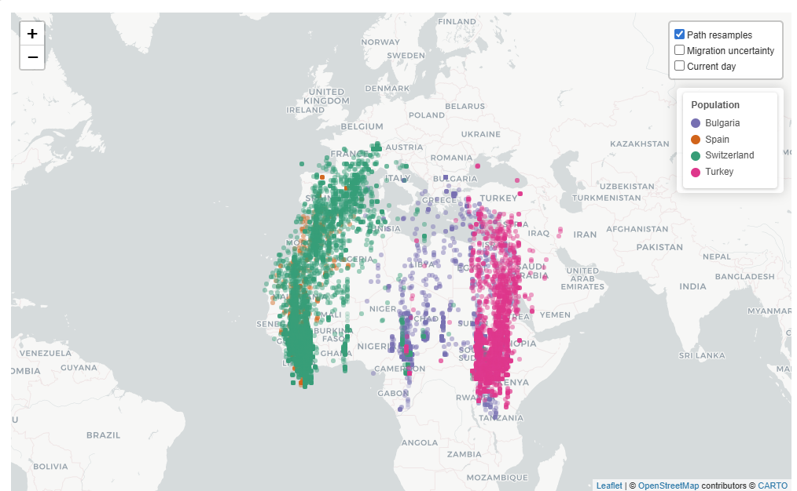
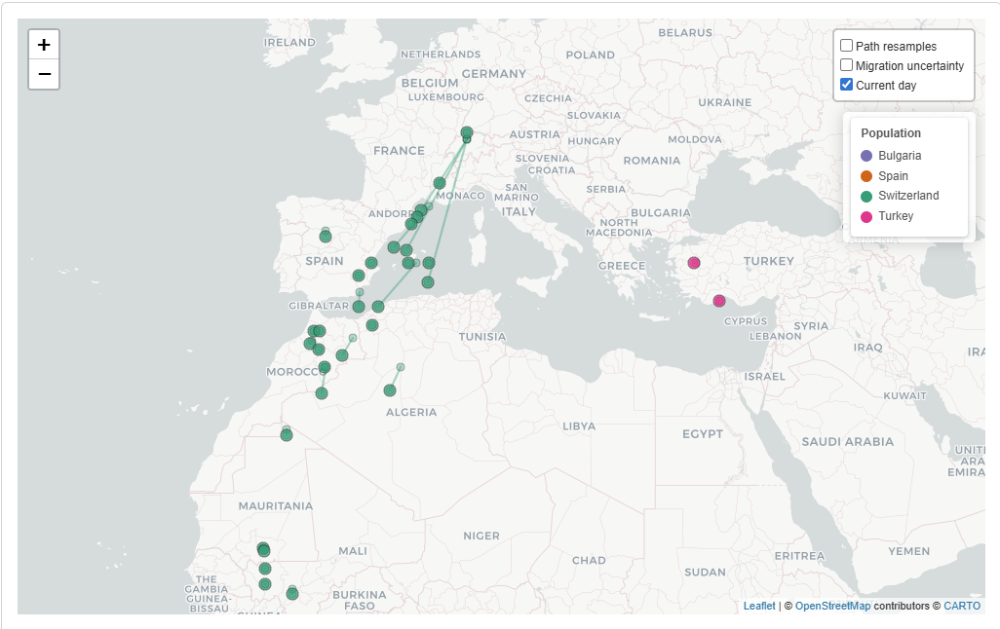
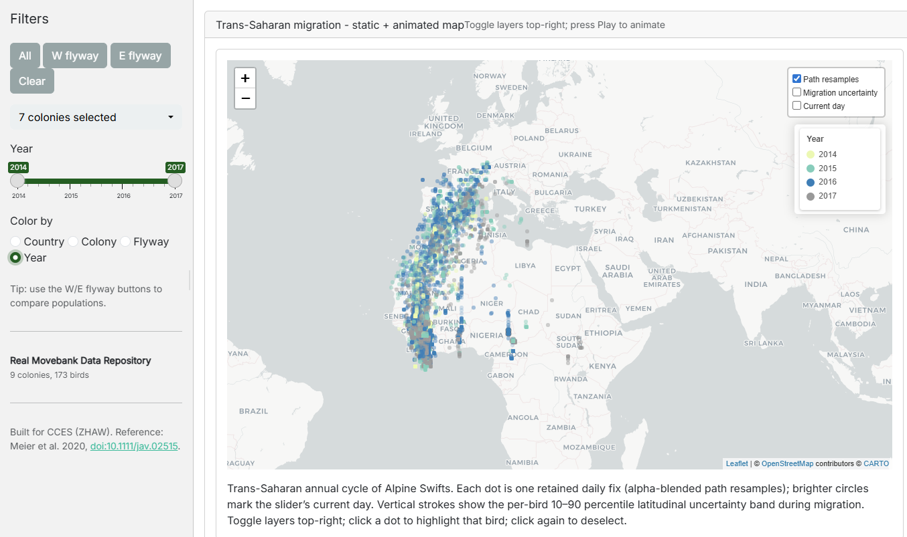
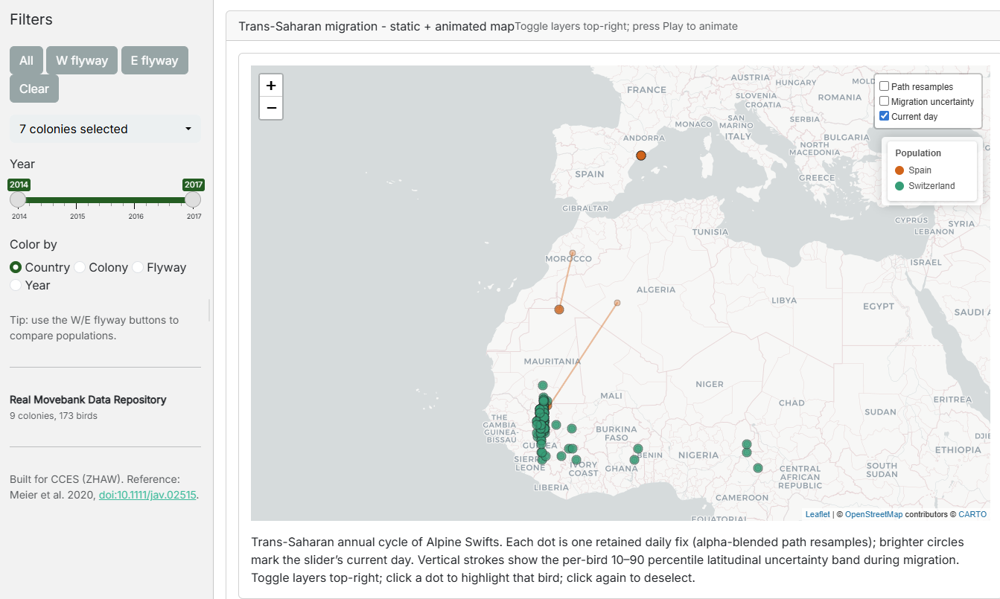
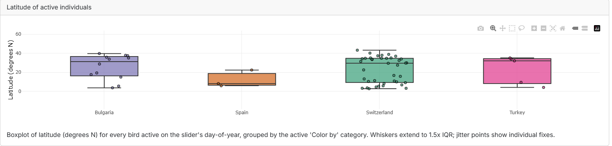

\newpage

# Dashboard Context and Goals

The Alpine Swift (*Tachymarptis melba*) is a small aerial insectivore that spends the majority of its life airborne. The species is capable of completing trans-Saharan migration in approximately one week, which represents one of the shortest migration durations recorded among long-distance migrants [@meier2020]. Between 2014 and 2016, the Swiss Ornithological Institute conducted a long-term tracking study of the trans-Saharan migratory cycle using light-level geolocators. Individuals from four populations were tagged along an eleven-degree latitudinal gradient: Pirasali Island (Turkey), Tarragona (Spain), Sofia (Bulgaria), and multiple colonies in Switzerland. The principal finding of @meier2020 is that eastern and western populations follow two geographically distinct flyways across the Sahara, with the western populations migrating via the Iberian Peninsula and the eastern populations via the eastern Mediterranean. Furthermore, more southern colonies depart for their wintering grounds later in autumn, while more northern colonies depart from their wintering grounds later in spring, resulting in a breeding season up to 48 days shorter for the northernmost population relative to the southernmost [@meier2020]. The dashboard presented here provides an interactive analysis tool for exploring these datasets and following the geovisual analytics approach. As an extension topic animation was chosen. This, because it suits the spatial phenomena to be displayed well. Depicting movement data can of course be done using only static visualisations, however as movement also features a temporal domain, it is of advantage to deploy a visualisation media that has access to the temporal dimension as well. This is provided by animation.

# Data

The dashboard uses data from the long-term tracking project mentioned above, which includes data from 2014 to 2016. The data covers 173 Alpine Swifts from the nine different colonies. Each bird carried a light-level geolocator which continuously records ambient light levels. Geographic positions are derived in post-processing from the timing of the estimated sunrise and sunset events [@meier2020]. The tracks for every colony are published as a separate dataset on the Movebank Data Repository [@meier2020data_bulgaria; @meier2020data_turkey; @meier2020data_spain; @meier2020data_baden; @meier2020data_lenzburg; @meier2020data_luzern; @meier2020data_biel; @meier2020data_solothurn; @meier2020data_lausanne]. All datasets combined together cover a total of 268,158 entries.
It should be noted that there are no positions for the summer breeding months. That's because Alpine Swifts nest in dark cavities in the summer, and every time a bird ducks in or out, the sensor records a "false dusk" or "false dawn" effect which breaks down the position calculation. The authors of the study therefore discarded the positional fixes during summer [@meier2020].

## Data preprocessing
Before any data reaches the dashboard, a small pipeline in R/data_processing.R cleans the raw Movebank CSVs and adds the derived columns that are needed for the visualisation. Each fix is first labelled as breeding, migration or wintering by reading the Movebank comments column. An airspeed filter then drops every pair of consecutive fixes that would require more than 50 km/h average air speed. This because [@meier2020] reports an average airspeed of 12.6 m/s (45.4 km/h) for alpine swifts. Therefore, if a swift individual travels a distance that would require an air speed of 50 km/h or above, then this is likely caused by the positional uncertainty of the logger. It is worth pointing out, that the cut-off threshold of 50 km/h is subjectively chosen. The surviving fixes are collapsed to one daily-median position per day. A per-bird summary (arrival, departure, length of stay at the breeding site) is calculated last. The full processed table is cached to data/processed/tracks_processed.rds. This is done, as otherwise the whole data processing would have to be run every time upon start up of the dashboard which would inflate start up time.

# Project structure
The dashboard is a modular R Shiny application. app.R is the entry point and sources seven files from R/: helpers.R (colour palettes, basemap configuration, legend builder), data_acquisition.R (Movebank CSV ingestion with a synthetic fallback), data_processing.R (the pipeline described above), and four UI / server modules — mod_filters.R (sidebar filters), mod_metrics.R (top-right KPI strip), mod_phenology.R (latitude-by-day-of-year plot) and mod_animation.R (integrated map, server-driven animation, click handler and on-map legend). Styling lives in www/custom.css; the raw and processed data sit under data/; the About-tab text, the bibliography and this report itself live under reports/. Cross-module communication is one-directional, flowing through the reactives returned by filters_server(), which keeps each module independently testable and the dependency graph easy to follow.

# Storytelling Concept and Intended Insights

The aim of geovisual analytics is to detect the expected while enabling the discovery of the unexpected [@thomas2005]. To support this, the geovisual analytics approach follows Shneiderman's information-seeking mantra, which describes first providing an overview of the complete dataset, then offering utilities for zooming and filtering, and finally enabling access to additional details on demand [@shneiderman1996]. The storytelling concept of this dashboard follows this structure. The initial view is intended to convey that seasonal migration occurs between Europe and Africa, and that two primary flyways exist, one via the Iberian Peninsula and one via the eastern Mediterranean. Further it should be clear to the reader that alpine swift individuals from different colonies scattered over Europe are visible. Subsequent filtering and zooming interactions are designed to allow users to observe that higher-latitude colonies depart earlier in autumn and return later in spring. Beyond these primary findings, the dashboard is intended to support open-ended exploration of additional patterns within the data. This because a geoanalytical dashboard also needs to enable to discover unexpected patterns like stated above.

To guide the dashboard design, the Cairo Visualisation Wheel was applied as a conceptual framework [@cairo2012]. This tool allows a visualisation designer to evaluate a product along six dimensions and assess whether it tends toward greater complexity and analytical depth or toward greater simplicity and accessibility. A schematic of the wheel is provided in @fig-cairo-wheel. It is argued here that a dashboard intended for geovisual analytics should position itself toward the complex and analytical end of the spectrum. The following design positions were adopted based on this reasoning.

{#fig-cairo-wheel width=70% fig-pos="H"}

**Multidimensionality – Unidimensionality:** The dashboard is designed to allow examination of the data from multiple analytical perspectives. Users are able to reclassify observations along the temporal dimension as well as by categorical attributes such as flyway membership or colony of origin.

**Density – Lightness:** Available screen space is used densely, with a large volume of individual position fixes displayed simultaneously to support pattern recognition across the full dataset.

**Functionality – Decoration:** The intended audience consists of specialists with an interest in the underlying scientific data. Decorative elements are therefore omitted in favour of an objective and information-dense presentation.

**Originality – Familiarity:** Familiar visualisation forms, including animated point maps, line charts and boxplots, are preferred over novel representations. It is worth pointing out that familiar visualisation types push the dashboard towards a more intelligible and shallower visualisation product, which is opposing our argumentation, however we believe that this choice is justified given that this facilitates interpretability.

# Key Dashboard Functionalities

## Spatial Map

The central element of the dashboard is an interactive map, which serves a dual purpose as both a static data display and an animation canvas.

{#fig-spatial-map width=85% fig-pos="H"}

In its default static state, the map displays all retained daily position fixes simultaneously, as shown in @fig-spatial-map. This implements the "overview first" principle of Shneiderman's mantra: upon entering the dashboard, the user is immediately presented with a comprehensive spatial overview from which the two flyways and the European–African migration corridor can be identified. Further the reader identifies, that different populations belonging to different countries are the object of study which is depicted by the colouring.

When a temporal animation is active, the map transitions to display the positional development of tracked individuals over the course of the annual cycle, as illustrated in @fig-spatial-map-animation.

{#fig-spatial-map-animation width=85% fig-pos="H"}

## Filter Menu

The filter menu enables restriction of the displayed data by various attributes. Individual colonies can be selected or deselected via a dropdown menu, and a year slider controls which annual tracking periods are included. Pre-configured quick filters are provided for common analytical tasks. In particular, the western and eastern flyways can be selected with a single action. This filtering menue enables the zoom and filter stage of Schneidermanns mantra. An example of the quick filter and year-based colouring in use is shown in @fig-quick-filter-and-year.

## Attribute Selection Menu

Below the filter menu, a separate control allows users to colour position fixes according to a selected attribute, enabling visual stratification of the data by country of origin, colony, flyway, or year. This attribute selection menu links to Cairo's dimension of unidimensionality-multidimensionality as it allows a multidimensional view onto the data. Country, colony and flyway are nominal attributes and are therefore encoded using a qualitative ColorBrewer palette. @fig-quick-filter-and-year illustrates the map coloured by year membership following application of the western flyway quick filter.

{#fig-quick-filter-and-year width=85% fig-pos="H"}

### Integration into Animation

Both the filter menu and the attribute selection menu remain active during animation playback. @fig-attr-and-filter-animation provides an example with the western flyway filter active and colouring applied by country of origin.

{#fig-attr-and-filter-animation width=85% fig-pos="H"}

## Geovisual Analytics Interactions

The dashboard implements several of the canonical geovisual analytics interactions.

**Panning, zooming, and navigation** are provided through the interactive map, allowing users to adjust the spatial extent and level of detail.

**Brushing and mouseover:** Hovering over any position fix displays a tooltip containing the individual tag identifier, geographic coordinates, colony membership, and date of recording.

**Linked views:** Two plots are linked to the spatial map. A set of boxplots displays the current latitudinal distribution of active individuals grouped by the selected attribute, and updates dynamically during animation playback (@fig-boxplot). A static line plot displays the latitudinal position of each tracked individual across the full annual cycle, with lines coloured by the selected grouping attribute (@fig-lineplot). This plot is particularly central to the intended narrative, as it visualises that more northern populations of alpine swift leave Europe earlier and depart from Africa at a later point, when compared with more southern populations.

{#fig-boxplot width=95% fig-pos="H"}

{#fig-lineplot width=95% fig-pos="H"}

Both boxplot as well as line plot are well known and easy to read visualisation types which were specifically chosen to be conform with our decision to lean towards familiarity in Cairo's Familiarity-Originality dimension.

**Animation:** The dashboard supports server-driven temporal animation of position fixes across the day-of-year axis. An optional moving-point trail can be toggled, displaying each individual's trajectory over the preceding one, three, or seven days, as visible in @fig-spatial-map-animation.

## Per-Bird flight path

Clicking on a particular fix highlights the complete flight path of this bird over the selected time frame.

# Individual Contributions

Both Lukas and Etienne where involved in searching an appropriate Dataset for visualisation. Lukas Buchmann implemented the dashboard and the data processing pipeline, and took the lead in preparing the hand-in Git repository. Etienne wrote the technical report. Both were involved in recording the explanatory video. Etienne set up a containerised version of the dashboard for hosting on Hugging Face.

# Declaration of AI Use

The large language models Claude Sonnet 4.6 and Claude Opus 4.5 were used as tools in this project. The models assisted with the generation of dashboard code, including sections produced through a prompt-to-code workflow in which the model was tasked with implementing specific functionality autonomously. Additional code sections were written manually. The models were further employed for code debugging, spelling correction, and formatting of the Quarto report. All generated code was reviewed before integration into the project.

\newpage

# References {.unnumbered}

::: {#refs}
:::